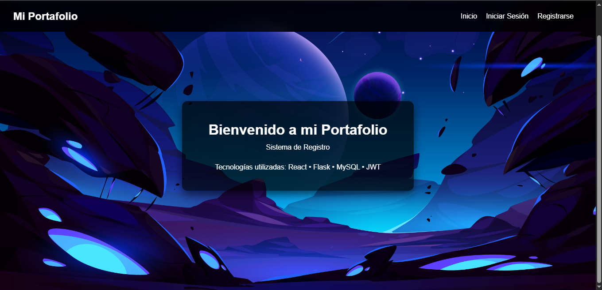
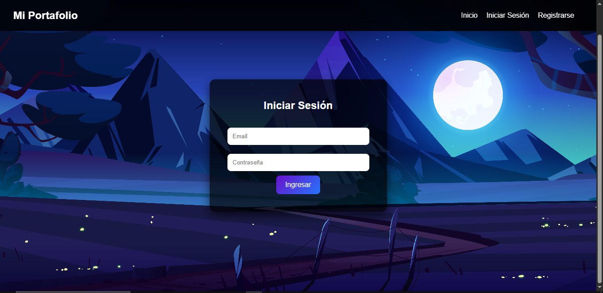
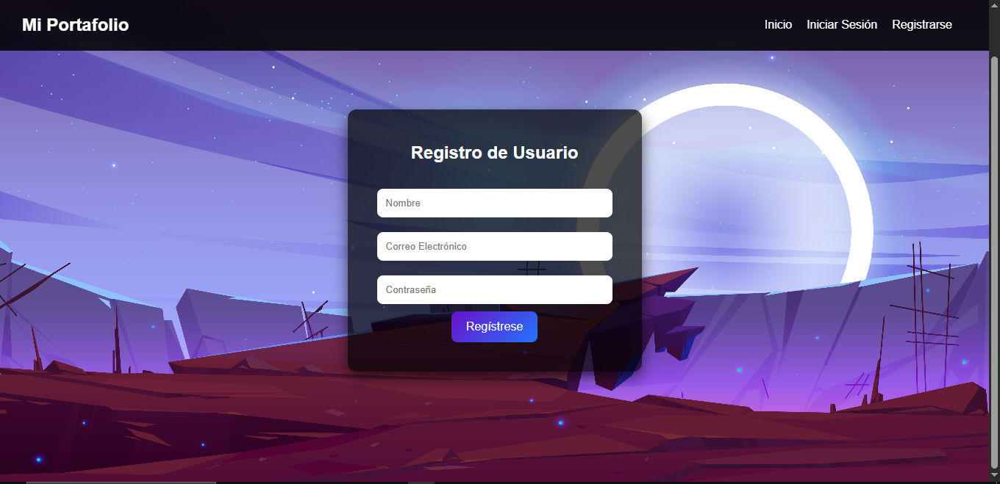
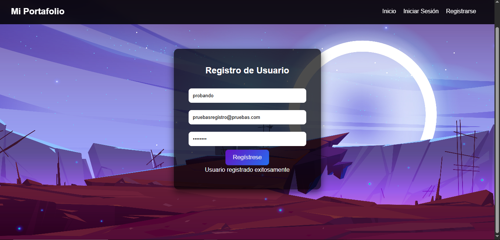
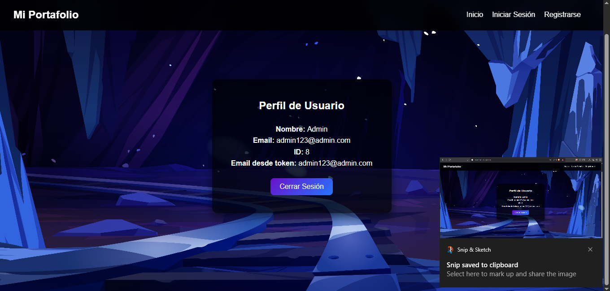
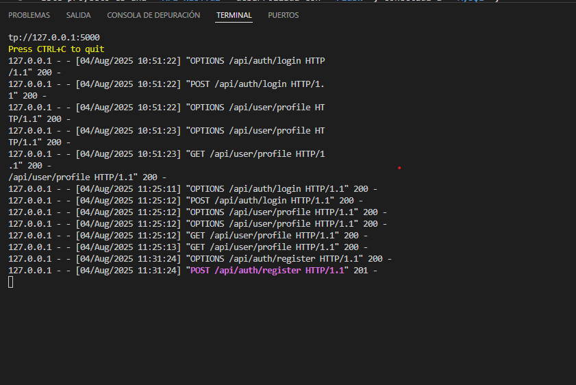

# 🎨 Frontend - Sistema de Registro de Usuarios

Este es el **Frontend** del proyecto **Sistema de Registro de Usuarios**, desarrollado en **React** con integración al backend en Flask.  
La aplicación permite el registro, inicio de sesión y gestión de perfil de usuarios autenticados mediante JWT.  

---

## 🚀 Tecnologías Utilizadas  

- [React 18](https://react.dev/)  
- [React Router DOM](https://reactrouter.com/en/main)  
- [Axios](https://axios-http.com/)  
- [React Scroll Parallax](https://react-scroll-parallax.damnthat.tv/)  
- [CSS3](https://developer.mozilla.org/es/docs/Web/CSS)   

---

## 📌 Características  

- Página de inicio con efecto **Parallax**.  
- Registro de nuevos usuarios con validación de campos.  
- Inicio de sesión con **JWT** y almacenamiento en **localStorage**.  
- Perfil de usuario protegido con rutas privadas.  
- Cierre de sesión seguro.  
- Diseño moderno, responsivo y con imágenes personalizadas en cada página.  

---

```bash
git clone https://github.com/Suikyo12/SistemaAuth.git
cd sistemaAuth/frontend
```

```bash
npm install
```

```bash
Accede desde el navegador a: http://localhost:5173

```

Para que este funcione debe estar corriendo el servidor backend que proporcionamos en la carpeta backend de este mismo proyecto.








